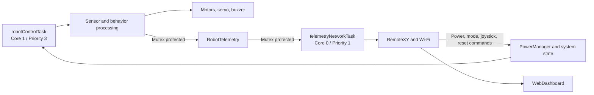
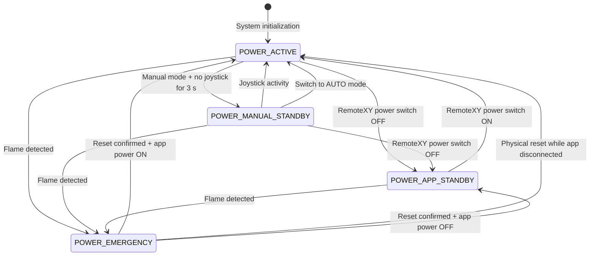
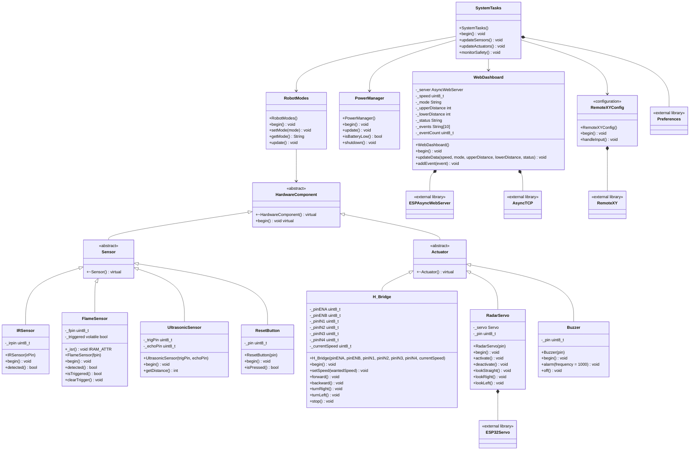

# 🤖 Autonomous Obstacle-Avoidance Robot

### ESP32-based line-following robot with obstacle avoidance, remote control, and live telemetry

> Embedded Systems and IoT Track project developed as part of the **EME Initiative Maker Internship Program** in Giza.

This project combines autonomous navigation, obstacle avoidance, emergency monitoring, wireless control, and a local web dashboard in one embedded system.

## 👥 Team

- Islam Asar
- Shahd Salah
- Amira Ragab
- Aya Nabil
- Safaa Abdelraheem

## 🔭 Overview

The robot is an ESP32-based mobile platform with two operating paths:

- 🤖 **Automatic operation** follows a line with three IR sensors and changes to obstacle avoidance when either ultrasonic sensor detects a nearby object.
- 🎮 **Manual operation** receives direction and speed commands from a RemoteXY mobile interface.
- 🔥 **Emergency operation** has priority over movement. A flame event stops the actuators, activates the buzzer, and locks the motors until a physical or mobile reset is confirmed.

The firmware combines object-oriented hardware drivers, FreeRTOS multitasking, persistent storage, power-state control, RemoteXY, and an asynchronous web dashboard.

## 🧭 Quick Navigation

- [👥 Team](#-team)
- [🔭 Overview](#-overview)
- [✨ Project Highlights](#-project-highlights)
- [📊 System Behavior](#-system-behavior)
- [🧠 Firmware Architecture](#-firmware-architecture)
- [🔩 Hardware](#-hardware)
- [🧩 Custom PCB](#-custom-pcb)
- [📍 ESP32 Pin Mapping](#-esp32-pin-mapping)
- [🔌 Wiring and Power](#-wiring-and-power)
- [💻 Software Setup](#-software-setup)
- [🚀 Build and Upload](#-build-and-upload)
- [✅ Verification](#-verification)
- [🎮 Operating Modes](#-operating-modes)
- [🌐 Web Dashboard](#-web-dashboard)
- [🚀 Future Enhancements](#-future-enhancements)
- [⚠️ Safety Notes](#safety-notes)
- [🎓 Educational Context](#-educational-context)
- [📁 Repository Contents](#-repository-contents)
- [🙏 Acknowledgements](#-acknowledgements)

## ✨ Project Highlights

- 🛣️ Autonomous line following with three infrared sensors.
- 🚧 Obstacle detection and avoidance with two ultrasonic sensors on a servo scanner.
- ⚙️ Dual DC motor control through an L298N H-Bridge.
- 🎮 Manual driving through a RemoteXY joystick and speed slider.
- 🔥 Interrupt-based flame detection and emergency lockout.
- 🛑 Physical and mobile emergency reset controls.
- ⚡ Active, manual standby, app standby, and emergency power states.
- ⏱️ FreeRTOS tasks for robot control and network services.
- 🌐 Local dashboard for speed, mode, distance, status, and event history.
- 💾 Persistent storage for boot count, obstacle threshold, and flame-event count.

## 📊 System Behavior

The following table summarizes the main observable behavior of the robot. The logical power state is managed independently from the automatic/manual behavior state.

| Operating condition | Sensor or command | Motor behavior | Servo and buzzer | Dashboard/status result |
| :--- | :--- | :--- | :--- | :--- |
| Automatic operation | No obstacle within the configured threshold | Line-following behavior drives the motors | Servo is available for scanning; buzzer is off | `DRIVE` / `ACTIVE` |
| Automatic operation | Upper or lower ultrasonic distance reaches the threshold | Obstacle-avoidance behavior changes direction | Servo scans the available path; buzzer is normally off | `AVOID` / `ACTIVE` |
| Manual operation | Joystick and speed slider command | Motors follow the selected direction and PWM speed | Servo remains available; buzzer is off | `MANUAL` / `ACTIVE` |
| Manual standby | No joystick activity for at least 3 seconds | Motors stop | Robot remains connected and monitored | `STANDBY` |
| App standby | RemoteXY power switch is OFF | Motors stop | Buzzer is turned off; firmware remains connected | `POWER OFF` |
| Emergency | Flame sensor trigger | Motors stop and remain locked | Servo detaches and buzzer sounds | `EMERGENCY` |
| Emergency cleared | Physical reset or RemoteXY reset | Active operation resumes, or app standby is restored if the app power switch is OFF | Buzzer is turned off and servo is reattached | `NORMAL` / `POWER OFF` |

## 🧠 Firmware Architecture

### 🧱 Object-Oriented Programming (OOP)

The firmware is organized around reusable C++ classes and interfaces:

- `HardwareComponent` defines the common initialization interface.
- `Sensor` and `Actuator` provide reusable base classes.
- `IRSensor`, `FlameSensor`, `UltrasonicSensor`, and `ResetButton` encapsulate sensor behavior in `HardwareComponent.h/.cpp`.
- `H_Bridge`, `Buzzer`, and `RadarServo` encapsulate actuator control in `HardwareComponent.h/.cpp`.
- `RobotModes` provides a polymorphic interface for `DriveMode`, `ScanMode`, `AvoidMode`, and `ManualMode`.
- `BehaviourFactory` creates and manages the available robot behavior modes.

This structure separates hardware access from robot behavior and makes individual modules easier to test, maintain, and extend.

### ⏱️ FreeRTOS Multitasking

The firmware uses two long-running FreeRTOS tasks pinned to separate ESP32 cores. This keeps time-sensitive robot control independent from Wi-Fi, RemoteXY, and dashboard processing.

#### 🧵 Task Configuration

| Task | Core | Priority | Stack allocation | Main responsibility |
| :--- | :---: | :---: | :---: | :--- |
| **`robotControlTask`** | **Core 1** | **3** | **8192 bytes** | Reads sensors, selects robot behavior, drives motors, updates power-state telemetry, and handles flame emergencies. |
| **`telemetryNetworkTask`** | **Core 0** | **1** | **8192 bytes** | Runs `RemoteXYEngine.handler()`, processes app commands, updates the web dashboard, synchronizes connection state, and publishes telemetry. |

The tasks are created in `initStorageAndRTOS()` with `xTaskCreatePinnedToCore()`. The higher priority of `robotControlTask` gives movement and emergency handling preference over network and dashboard work, while core pinning prevents both loops from competing for the same CPU core.

#### 🤖 `robotControlTask` Cycle

The control task runs continuously on Core 1:

1. **Emergency check:** It checks the flame trigger before any standby or movement logic. A new flame event calls `enterEmergency()`. An existing emergency calls `handleEmergency()` and keeps the motors stopped until reset.
2. **App standby check:** In `POWER_APP_STANDBY`, the task skips movement processing and yields for 50 ms while the network task remains available to receive the app power-on command.
3. **Sensor sampling:** It reads the upper and lower ultrasonic distances, with a 20 ms delay between readings.
4. **Telemetry update:** It writes the distances and logical power state to `sharedTelemetry` while holding `telemetryMutex`.
5. **Behavior selection:** In manual mode it checks the 3-second inactivity timeout; in automatic mode it selects `DriveMode` or `AvoidMode` according to the obstacle threshold.
6. **Cooperative yield:** The normal cycle ends with `vTaskDelay(pdMS_TO_TICKS(40))`, allowing other ready tasks to run.

#### 🌐 `telemetryNetworkTask` Cycle

The network task runs continuously on Core 0:

1. **RemoteXY service:** It calls `RemoteXYEngine.handler()` to process the Wi-Fi control interface.
2. **Connection synchronization:** On a new connection, it synchronizes the app power switch and automatic/manual mode with the current firmware state.
3. **Command processing:** It handles app standby, mode switching, joystick activity, speed changes, and emergency reset requests.
4. **Dashboard refresh:** Every 100 ms it copies the latest telemetry and calls `dashboard.updateData()` with speed, mode, distances, and status.
5. **Connection safety:** If RemoteXY disconnects during manual mode, the motor is stopped.
6. **Cooperative yield:** The loop ends with `vTaskDelay(pdMS_TO_TICKS(20))` so network handling remains responsive without busy-waiting.

#### 🔒 Shared Data and Synchronization

`RobotTelemetry sharedTelemetry` is accessed by both tasks. `telemetryMutex`, created with `xSemaphoreCreateMutex()`, provides mutual exclusion:

- A task calls `xSemaphoreTake(telemetryMutex, pdMS_TO_TICKS(10))` before reading or writing shared telemetry.
- The task updates the required fields only after acquiring the mutex.
- It calls `xSemaphoreGive(telemetryMutex)` immediately after the operation.
- If the mutex is not available within 10 ms, the update is skipped instead of blocking the control loop indefinitely.

The shared structure contains upper and lower distances, current behavior, power state, flame-emergency status, total flame events, and current PWM speed. Hardware objects and power-state transitions are shared through the same global system context, while each task keeps its own local timers and previous values as `static` state.

#### 🔄 Task Cooperation

`vTaskDelay()` is used throughout both loops for cooperative scheduling. The delays are intentional: emergency handling remains frequent, app standby continues monitoring at a lower rate, and normal control/network loops yield regularly instead of consuming a core in a busy loop.

### ⚡ Power Management

`PowerManager` centralizes the robot's logical power states. It controls how the firmware uses the actuators; it does not disconnect the battery or switch the buck-converter output physically. The battery, L298N motor supply, buck converter, ESP32, and common ground remain connected according to the hardware wiring described in [Wiring and Power](#-wiring-and-power).

#### ⚙️ Logical Power-State Map

| Power state | When it occurs | Actuator and control behavior | How it leaves the state |
| :---- | :---- | :---- | :---- |
| **`POWER_ACTIVE`** | At startup, after app power is turned on, after valid emergency reset, or while the robot is operating normally | Automatic and manual behavior may run. Motors, scanning servo, and buzzer are controlled by the active behavior or alert logic. | A manual-mode timeout enters `POWER_MANUAL_STANDBY`; the app power switch enters `POWER_APP_STANDBY`; a flame event enters `POWER_EMERGENCY`. |
| **`POWER_MANUAL_STANDBY`** | The robot is in manual mode and no joystick activity is detected for at least `MANUAL_STANDBY_TIMEOUT` (3 seconds) | The motors are stopped. The robot remains connected and monitoring; it is not electrically powered down. | Joystick activity or switching to automatic mode returns to `POWER_ACTIVE`; the app power switch enters `POWER_APP_STANDBY`; a flame event enters `POWER_EMERGENCY`. |
| **`POWER_APP_STANDBY`** | `RemoteXY.robot_power == 0`, meaning the mobile app power switch is OFF | The motors are stopped and the buzzer is turned off. The firmware, Wi-Fi, sensors, and dashboard remain alive so the app can turn the robot on again. | `RemoteXY.robot_power == 1` returns to `POWER_ACTIVE`; a flame event still enters `POWER_EMERGENCY`. |
| **`POWER_EMERGENCY`** | The flame sensor triggers, regardless of the current logical power state | Motors stop, the servo is detached, the buzzer sounds, telemetry records the emergency, and motor operation remains locked. | A physical reset button or RemoteXY reset clears the trigger. The system returns to `POWER_ACTIVE`, or to `POWER_APP_STANDBY` when the connected app power switch is still OFF. |

The state changes are implemented by `setMode()` in `PowerManager`, while `SystemTasks.cpp` decides when each transition occurs. The control task checks emergency conditions before standby conditions, so a flame event has priority over both standby states.

#### 🔄 Power-State Transition Diagram

> **Design note:** `POWER_APP_STANDBY` is a software-controlled virtual standby state, not a physical battery cutoff. The ESP32 must remain powered so it can receive the RemoteXY command that restores active operation.

### 🧮 ESP32 Memory Allocation Map

The project uses multiple ESP32 storage regions. The map below groups entries that use the same underlying memory so their lifetime and purpose are easier to compare.

#### ⚡ Flash Memory

| Flash storage area | Data stored by this project | Source reference and purpose |
| :---- | :---- | :---- |
| **Program/code** | Compiled instructions for `setup()`, FreeRTOS tasks, sensor drivers, actuators, robot modes, power management, and dashboard handlers | The compiled firmware is stored in flash and executed by the ESP32. |
| **Read-only constants** | Constant strings such as `Serial` messages, dashboard labels, CSS, JavaScript, and the embedded HTML page | `F()` strings and the `PROGMEM` HTML buffer reduce pressure on runtime RAM. |
| **`PROGMEM` data** | RemoteXY UI configuration matrix and the dashboard HTML template | `RemoteXY_CONF_PROGMEM` in `RemoteXYConfig.h` and `html` in `WebDashboard.cpp`. |
| **NVS partition** | Total flame-event count and obstacle threshold | `Preferences` stores `flame_cnt` and `obs_thresh` in the `robot_nvs` namespace, preserving them across normal restarts and power cycles. |

#### 🧠 DRAM

| DRAM storage area | Data stored by this project | Source reference and purpose |
| :---- | :---- | :---- |
| **Global/static data** | Hardware objects, `PowerManager`, `WebDashboard`, `Preferences`, `RobotTelemetry`, system flags, GPIO configuration, and the RemoteXY runtime structure | Global and static variables remain available for the entire program lifetime. |
| **ISR state** | The flame-trigger flag `_triggered` | `FlameSensor::_triggered` is `volatile` because it is written by the interrupt service routine and read by the control task. |
| **Static local state** | Previous commands, joystick values, connection state, dashboard timers, and last automatic state | `static` locals in `SystemTasks.cpp` preserve values between task-loop iterations. |
| **Fixed event buffer** | The latest 10 dashboard event strings | `WebDashboard::_events[10]` limits the event-log container size; each `String` may still use heap storage for its text. |

#### 🧵 Heap

| Heap allocation area | Data stored by this project | Source reference and purpose |
| :---- | :---- | :---- |
| **FreeRTOS runtime objects** | The two task control blocks and their task stacks | `xTaskCreatePinnedToCore()` creates `RobotControlTask` and `TelemetryNetworkTask` with 8192-byte stack sizes each. |
| **Synchronization objects** | The telemetry mutex | `xSemaphoreCreateMutex()` allocates the FreeRTOS mutex used to protect `sharedTelemetry`. |
| **Dynamic C++ and library data** | `String` contents, asynchronous web-server request data, Wi-Fi/network buffers, and other library-managed objects | `String` members in `WebDashboard` and temporary dashboard JSON/status values may allocate from the heap. |

#### 🕒 RTC Memory

| RTC storage area | Data stored by this project | Source reference and purpose |
| :---- | :---- | :---- |
| **RTC data memory** | The boot counter | `RTC_DATA_ATTR int bootCount` is placed in RTC data memory so it can survive deep-sleep resets when RTC power is retained. |

#### Runtime Allocation Details

- The behavior factory creates one static instance of each mode: `DriveMode`, `ScanMode`, `AvoidMode`, and `ManualMode`. These objects are reused instead of being allocated repeatedly.  
- The dashboard owns a fixed array of 10 event entries, while the text held by each Arduino `String` can be dynamically allocated.  
- The project does not directly call `new`, `delete`, `malloc()`, or `free()`. Dynamic allocation is performed internally by FreeRTOS, ESPAsyncWebServer, Wi-Fi, `String`, and other ESP32 libraries.  
- `RobotTelemetry` is a global shared structure in DRAM; `telemetryMutex` protects concurrent access from the two FreeRTOS tasks.  
- The exact address and remaining capacity of each memory region depend on the selected ESP32 core, board configuration, and linked libraries. Use the build output or ESP32 heap APIs for exact runtime measurements.

### 📱 RemoteXY Integration

RemoteXY provides the wireless mobile control interface through the ESP32 Wi-Fi access point. It is used for:

- Switching between automatic and manual modes.  
- Turning robot power on or off through app standby.  
- Controlling direction with the joystick.  
- Adjusting manual speed with the slider.  
- Clearing the emergency state with the app reset button.

### 🌐 Asynchronous Web Server

The `WebDashboard` class uses `ESPAsyncWebServer` to provide a local monitoring interface without blocking the main robot-control flow. The dashboard:

- Serves the robot status page over HTTP.  
- Exposes a `/data` endpoint containing live telemetry.  
- Displays speed, current mode, ultrasonic distances, system status, and recent events.  
- Refreshes the displayed data periodically through client-side JavaScript.

### 📐 UML Class Diagram

The following diagram represents the core classes, interfaces, enumerations, and relationships implemented in the firmware source files:

## 🔩 Hardware

- ESP32 development board compatible with `ESP32 Dev Module`.  
- L298N dual H-bridge motor driver.  
- Four DC motors and a robot chassis.  
- Three digital infrared line sensors.  
- Two ultrasonic distance sensors.  
- Servo motor for ultrasonic scanning.  
- Flame sensor.  
- Passive buzzer.  
- Push button for emergency reset.  
- Battery and suitable voltage regulation.  
- Custom-fabricated ESP32 carrier and breakout PCB.

## 🧩 Custom PCB

In addition to the breadboard prototype, a custom PCB was fabricated for the project. The PCB provides a more organized and reliable connection point for the ESP32 and the robot wiring.

The board includes:

- An ESP32 mounting and breakout area.  
- Clearly labeled GPIO headers for the connected sensors, actuators, and motor driver.  
- Dedicated power and ground headers.  
- 5 V, 3.3 V, VIN, and GND connection points.  
- Breakout access to GPIO pins used by the robot, including the motor-control, sensor, servo, flame-sensor, reset-button, and buzzer connections.  
- Additional header space for routing external modules and simplifying maintenance.

The PCB is used as the central interface between the ESP32, the power-distribution system, the L298N H-Bridge, and the external sensors and actuators. The labeled headers make the final wiring easier to inspect and reduce loose breadboard connections.

The fabricated board should be connected according to the GPIO mapping and power-distribution information documented in this README. Always verify the board labels, voltage rails, and ground connections before powering the robot.

### 🖥️ PCB Layout

The following image shows the fabricated carrier and breakout PCB layout, including the ESP32 footprint, labeled GPIO headers, power connections, ground headers, and 3.3 V breakout.

## 📍 ESP32 Pin Mapping

| Component | Signal | ESP32 GPIO |
| :---- | :---- | ----: |
| Flame sensor | Output | 23 |
| Emergency reset button | Input with pull-up | 22 |
| Passive buzzer | Signal | 4 |
| L298N | ENA / left motor PWM | 25 |
| L298N | ENB / right motor PWM | 26 |
| L298N | IN1 | 27 |
| L298N | IN2 | 14 |
| L298N | IN3 | 16 |
| L298N | IN4 | 17 |
| Scanning servo | Signal | 13 |
| Left IR sensor | Digital output | 33 |
| Center IR sensor | Digital output | 32 |
| Right IR sensor | Digital output | 35 |
| Upper ultrasonic | Trigger | 5 |
| Upper ultrasonic | Echo through 1 kΩ/2 kΩ divider | 18 |
| Lower ultrasonic | Trigger | 19 |
| Lower ultrasonic | Echo through 1 kΩ/2 kΩ divider | 21 |

The GPIO assignments are defined near the top of [Autonomous\_Robot.ino](http://Autonomous_Robot/Autonomous_Robot.ino). Update the named constants there if the physical wiring changes.

### 🛡️ Ultrasonic Echo Voltage Divider

The ultrasonic sensors are powered at 5 V, so each 5 V Echo signal is reduced before entering the 3.3 V ESP32 GPIO:

Ultrasonic Echo ── 1 kΩ ──┬── ESP32 Echo GPIO

&nbsp;&nbsp;&nbsp;&nbsp;&nbsp;&nbsp;&nbsp;&nbsp;&nbsp;&nbsp;&nbsp;&nbsp;&nbsp;&nbsp;&nbsp;&nbsp;&nbsp;&nbsp;&nbsp;&nbsp;&nbsp;&nbsp;&nbsp;&nbsp;&nbsp;&nbsp;|

&nbsp;&nbsp;&nbsp;&nbsp;&nbsp;&nbsp;&nbsp;&nbsp;&nbsp;&nbsp;&nbsp;&nbsp;&nbsp;&nbsp;&nbsp;&nbsp;&nbsp;&nbsp;&nbsp;&nbsp;&nbsp;&nbsp;&nbsp;&nbsp;&nbsp;2 kΩ

&nbsp;&nbsp;&nbsp;&nbsp;&nbsp;&nbsp;&nbsp;&nbsp;&nbsp;&nbsp;&nbsp;&nbsp;&nbsp;&nbsp;&nbsp;&nbsp;&nbsp;&nbsp;&nbsp;&nbsp;&nbsp;&nbsp;&nbsp;&nbsp;&nbsp;&nbsp;|

&nbsp;&nbsp;&nbsp;&nbsp;&nbsp;&nbsp;&nbsp;&nbsp;&nbsp;&nbsp;&nbsp;&nbsp;&nbsp;&nbsp;&nbsp;&nbsp;&nbsp;&nbsp;&nbsp;&nbsp;&nbsp;&nbsp;&nbsp;&nbsp;&nbsp;GND

The 1 kΩ resistor is connected in series with the Echo signal, and the 2 kΩ resistor is connected from the ESP32-side node to GND. This produces approximately 3.3 V from a 5 V Echo signal, protecting the ESP32 input. The upper ultrasonic Echo divider connects to GPIO18, and the lower ultrasonic Echo divider connects to GPIO21. Do not connect a 5 V Echo output directly to an ESP32 GPIO.

## 🔌 Wiring and Power

The robot uses a separate motor-power path and a regulated logic-power path to keep the ESP32 and sensors stable while the motors are running.

### 🔋 Power Flow

1. The battery pack provides the main power source for the robot.  
2. The battery output is connected to the L298N H-Bridge motor supply. The H-Bridge distributes motor power to the four DC motors and receives direction and PWM control signals from the ESP32.  
3. The battery output is also connected to the buck converter input.  
4. The buck converter reduces and regulates the battery voltage to a suitable level for the ESP32, sensors, servo motor, flame sensor, buzzer, and other low-voltage actuators.  
5. The regulated buck-converter output is connected to the appropriate power rail for the ESP32 and low-voltage components.  
6. The battery negative terminal, buck-converter ground, L298N ground, ESP32 ground, sensor grounds, servo ground, and buzzer ground must be connected together.

### 🔗 Connectivity Summary

| Power or signal path | Connection | Purpose |
| :---- | :---- | :---- |
| Battery pack | Battery positive/negative to L298N motor supply and GND | Supplies the DC motors through the H-Bridge |
| Battery pack | Battery positive/negative to buck-converter input | Provides the source voltage for regulation |
| Buck converter | Regulated output to ESP32 power input and low-voltage rail | Powers the ESP32 and logic-side components |
| L298N H-Bridge | Motor outputs to the four DC motors | Controls motor direction and speed |
| ESP32 to L298N | ENA, ENB, IN1, IN2, IN3, and IN4 | Sends PWM and direction-control signals |
| ESP32 to sensors | GPIO connections listed in the pin-mapping table | Reads line, distance, flame, and reset-button inputs |
| ESP32 to actuators | Servo signal and buzzer signal | Controls scanning and audible alerts |
| All modules | Common ground | Provides a shared electrical reference for control signals |

The buck converter output must be adjusted and measured before connecting it to the ESP32 or any sensor. Do not connect the raw battery voltage directly to components that require regulated low-voltage power, and do not power the motors from the ESP32 3.3 V pin.

### 🖥️ Wiring Schematic

The schematic below shows the ESP32 connections to the L298N H-Bridge, motors, IR sensors, ultrasonic sensors, servo, flame sensor, buzzer, battery, and regulated power path.

## 💻 Software Setup

- Arduino IDE or Arduino CLI.  
- ESP32 board support package.  
- Board target: `ESP32 Dev Module`.  
- The following libraries:  
  - `ESP32Servo`  
  - `Preferences` (included with the ESP32 core)  
  - `ESPAsyncWebServer`  
  - `AsyncTCP`  
  - `RemoteXY`

### ⚙️ Configuration

RemoteXY is configured as an ESP32 Wi-Fi access point in [RemoteXYConfig.h](http://Autonomous_Robot/RemoteXYConfig.h):

- Wi-Fi SSID: `Robot_ESP32`  
- RemoteXY server port: `6377`  
- RemoteXY access password: configured in the same file

Change the default Wi-Fi credentials and access password before deploying the robot in a public or shared environment.

## 🚀 Build and Upload

1. Open the project folder in Arduino IDE.  
2. Select the ESP32 board package and choose `ESP32 Dev Module`.  
3. Install the required libraries.  
4. Open `Autonomous_Robot/Autonomous_Robot.ino`.  
5. Select the correct serial port.  
6. Compile the sketch.  
7. Upload it to the ESP32.  
8. Open the Serial Monitor at `115200` baud.

The sketch starts the servo, sensors, motor driver, RemoteXY service, and local web dashboard during `setup()`.

## ✅ Verification

The project was checked against the implementation and the generated ESP32 build configuration:

- ✅ C++ source files report no diagnostics in the development environment.  
- ✅ The implementation files compile successfully using the project compile commands.  
- ✅ GPIO assignments in the documentation match the named constants in `Autonomous_Robot.ino`.  
- ✅ The ultrasonic Echo protection is documented for both Echo inputs through 1 kΩ/2 kΩ voltage dividers.  
- ✅ FreeRTOS task creation, core pinning, priorities, stack sizes, mutex protection, and task delays are documented from `SystemTasks.cpp`.  
- ✅ The power-state table and state diagram cover startup, manual standby, app standby, emergency entry, and reset recovery.

Before physical operation, verify the regulated buck-converter output, common ground, motor-driver wiring, and Echo voltage-divider connections with a multimeter.

## 🎮 Operating Modes

### 🤖 Automatic Mode

The robot follows the line using the left, center, and right IR sensors. When either ultrasonic sensor detects an obstacle closer than the configured threshold, the robot switches to obstacle avoidance.

### 🕹️ Manual Mode

The robot can be controlled through the RemoteXY joystick. The speed slider controls the motor speed. Manual standby is entered after a period of inactivity.

### 🔥 Emergency Mode

A flame event stops the motors, detaches the servo, activates the buzzer, and locks the robot until the physical reset button or the RemoteXY reset control is used.

## 🌐 Web Dashboard

The ESP32 hosts a local dashboard on port `80`. After connecting to the robot Wi-Fi, open the IP address printed in the Serial Monitor, usually:

http://192.168.4.1/

The dashboard displays:

- Current speed and robot mode.  
- Upper and lower ultrasonic distances.  
- Current system status.  
- Recent robot events.

## 🚀 Future Enhancements

- 📷 Add a camera-based navigation or remote-inspection module.  
- 📡 Add cloud telemetry or MQTT while keeping the local dashboard available.  
- 🔋 Add battery-voltage measurement and low-battery protection to the power-state controller.  
- 🧭 Add wheel encoders for closed-loop speed and distance estimation.  
- 🧪 Add automated hardware-in-the-loop tests for sensor and power-state transitions.

&nbsp;

## ⚠️ Safety Notes

- Do not power motors directly from the ESP32 3.3 V pin.  
- Connect the motor-driver ground and ESP32 ground together.  
- Use a regulated power supply suitable for the ESP32, sensors, servo, and motors.  
- Test the emergency stop and reset behavior with the wheels lifted before operating the robot on the floor.  
- Change the default RemoteXY credentials before deployment.

## 🎓 Educational Context

This project demonstrates the integration of embedded control, sensor processing, motor actuation, real-time task scheduling, wireless communication, persistent storage, and web-based telemetry within the **Embedded Systems and IoT Track** of the **EME Initiative**.

## 📁 Repository Contents

.

├── Autonomous\_Robot/                \# ESP32 firmware source files

│   ├── Autonomous\_Robot.ino         \# Main sketch and GPIO mapping

│   ├── HardwareComponent.cpp/.h     \# Sensor and actuator hardware drivers

│   ├── RobotModes.cpp/.h            \# Drive, scan, avoid, and manual behavior modes

│   ├── PowerManager.cpp/.h          \# Logical power-state management

│   ├── RemoteXYConfig.h             \# Wi-Fi and RemoteXY interface configuration

│   ├── WebDashboard.cpp/.h          \# Asynchronous local web dashboard

│   └── SystemTasks.cpp/.h           \# FreeRTOS tasks and system control

├── Images/                          \# Project images

│   ├── Custom\_PCB\_Layout.png        \# Rendered custom PCB layout

│   └── Robot\_Wiring\_Schematic.png   \# Rendered wiring schematic

├── Schematic.fz                     \# Fritzing schematic project

├── Simulation.pdsprj                \# Proteus simulation project

└── README.md                        \# Project documentation

## 🙏 Acknowledgements

This project was developed as part of the **Maker Internship Program 2026**, within the **Embedded Systems and IoT Track**.

The program is hosted by **ITIDA \- EME Innovation Labs (Giza)** and operated and supervised by **Origin Integrated Systems (OIS)**.

The team would like to acknowledge the program organizers and supervisors for supporting this practical project, which combines ESP32 firmware development, autonomous robotics, electronics fabrication, real-time software design, power management, and IoT-oriented control interfaces.